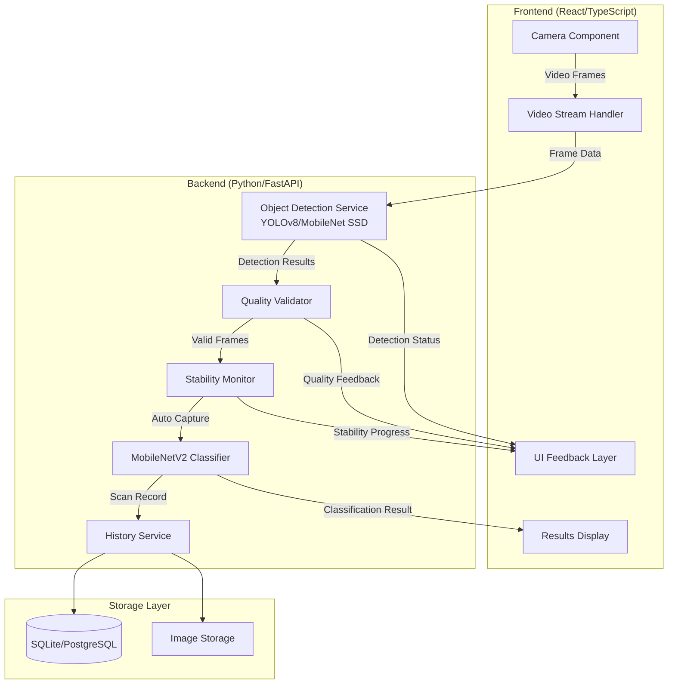

# Design Document: Smart Auto-Scan Waste Detection

## Overview

The Smart Auto-Scan Waste Detection feature transforms the current manual scanning workflow into an intelligent, automated system that continuously monitors the camera feed, detects recyclable objects in real-time, validates image quality, and automatically captures and classifies waste materials when optimal conditions are met.

### Current System Issues

The existing implementation has several critical issues that this design addresses:

1. **Model Loading Failure**: MobileNetV2 classifier fails to load during server startup
2. **UI Layout Problem**: AI feedback overlay blocks camera view
3. **Detection Scope**: System detects "person" instead of recyclable objects
4. **No Object Filtering**: All detected objects trigger classification, including non-recyclables
5. **Manual Capture**: Requires user to manually press button
6. **History Pollution**: Non-recyclable objects stored in history/analytics
7. **Single-Shot Mode**: Camera stops after each scan

### Design Goals

This design implements a two-stage detection pipeline:

1. **Stage 1 - Object Detection**: Real-time multi-object detection using YOLOv8/MobileNet SSD/EfficientDet to identify all objects in frame
2. **Stage 2 - Material Classification**: MobileNetV2 classifier for precise material type identification (Plastic, Paper, Metal, Glass)

The system continuously scans, automatically captures when recyclable objects are detected with sufficient quality, classifies the material, displays results, updates history, and immediately resumes scanning.

## Architecture

### System Components



### Two-Stage Detection Pipeline

**Stage 1: Object Detection (Real-Time)**
- **Purpose**: Identify all objects in frame, filter for recyclables
- **Models**: YOLOv8-nano, MobileNet SSD, or EfficientDet-Lite
- **Input**: Camera frame (640x480 or 1280x720)
- **Output**: Bounding boxes with class labels and confidence scores
- **Frequency**: 10-15 FPS
- **Recyclable Classes**: bottle, cup, can, paper, cardboard, glass_bottle, plastic_container

**Stage 2: Material Classification (On-Demand)**
- **Purpose**: Precise material type identification
- **Model**: MobileNetV2 (pre-trained, fine-tuned)
- **Input**: Cropped object region (224x224)
- **Output**: Material class (Plastic, Paper, Metal, Glass) with confidence
- **Trigger**: Only when recyclable object detected with quality/stability criteria met

### Component Responsibilities

#### Frontend Components

**Camera Component**
- Activates camera on mount
- Streams video to canvas element
- Captures frames at 10-15 FPS
- Sends frames to backend for detection
- Handles camera permissions and errors

**Video Stream Handler**
- Manages WebSocket/HTTP connection to backend
- Sends frame data (base64 or binary)
- Receives detection results
- Implements frame throttling to maintain performance

**UI Feedback Layer**
- Renders scan frame overlay (circular or rectangular guide)
- Displays detection circle with color-coded status
- Shows real-time guidance messages
- Displays stability progress indicator
- Positioned below camera view (non-overlapping)

**Results Display**
- Shows classification results
- Displays material type, confidence, bin color
- Provides recycling tips
- Offers "Scan Again" action
- Auto-dismisses after 5 seconds, returns to scanning

#### Backend Services

**Object Detection Service**
- Loads YOLOv8/MobileNet SSD/EfficientDet model on startup
- Processes incoming frames
- Detects all objects with bounding boxes
- Filters for recyclable object classes only
- Returns detection results with coordinates and confidence
- Ignores non-recyclable objects (person, chair, table, hand, etc.)

**Quality Validator**
- Validates object size (20-80% of frame area)
- Validates object centering (within 15% of frame center)
- Validates image sharpness (Laplacian variance > 100)
- Validates brightness (40-220 on 0-255 scale)
- Returns quality status and specific feedback

**Stability Monitor**
- Tracks consecutive valid frames
- Requires 15 consecutive frames (~1.5 seconds at 10 FPS)
- Resets counter on quality drop
- Triggers automatic capture when threshold met
- Returns stability progress percentage

**MobileNetV2 Classifier**
- Loads model on startup: `tf.keras.models.load_model("backend/model/sortiq_model.h5")`
- Receives cropped object image
- Preprocesses to 224x224 RGB
- Classifies into Plastic, Paper, Metal, Glass
- Returns class and confidence score
- Marks as "Unknown" if confidence < 0.40

**History Service**
- Creates scan records for recyclable objects only
- Stores timestamp, class, confidence, thumbnail
- Persists to database
- Updates analytics aggregates
- Filters out non-recyclable detections

### Data Flow

**Continuous Scanning Flow**:
1. Camera streams frames to frontend canvas
2. Frontend sends frames to backend at 10 FPS
3. Object Detection Service analyzes frame
4. If recyclable object detected:
   - Quality Validator checks image quality
   - If quality sufficient, Stability Monitor increments counter
   - UI shows "Hold steady" with progress indicator
5. When 15 consecutive valid frames achieved:
   - System auto-captures frame
   - Crops object region using bounding box
   - Sends to MobileNetV2 Classifier
   - Classifier returns material type and confidence
6. If confidence >= 0.40:
   - Display results with bin color and tip
   - Save to history and analytics
   - Provide haptic feedback
7. After 5 seconds or user dismissal:
   - Return to continuous scanning mode
   - Reset all counters
8. If non-recyclable object detected:
   - Show message: "Detected: [Object] - Not a recyclable item"
   - Do NOT capture, classify, or store
   - Continue scanning

**Error Handling Flow**:
- Camera failure: Show error, offer retry
- Detection timeout: Return to scanning after 5 seconds
- Classification failure: Show error, offer manual retry
- Network error: Queue scan for retry, continue scanning

## Components and Interfaces

### Frontend Interfaces

#### CameraComponent Props
```typescript
interface CameraComponentProps {
  onFrameCapture: (frameData: string) => void;
  onError: (error: CameraError) => void;
  frameRate: number; // Default: 10 FPS
}

interface CameraError {
  type: 'permission_denied' | 'not_found' | 'not_readable' | 'unknown';
  message: string;
}
```

#### DetectionResult Interface
```typescript
interface DetectionResult {
  detected: boolean;
  objectClass: string | null; // e.g., "bottle", "can", "paper"
  isRecyclable: boolean;
  boundingBox: BoundingBox | null;
  confidence: number;
  qualityStatus: QualityStatus;
  stabilityProgress: number; // 0-100
  guidanceMessage: string;
  indicatorColor: 'gray' | 'yellow' | 'green';
}

interface BoundingBox {
  x: number;
  y: number;
  width: number;
  height: number;
}

interface QualityStatus {
  isValid: boolean;
  sizeOk: boolean;
  centeringOk: boolean;
  sharpnessOk: boolean;
  brightnessOk: boolean;
}
```

#### ClassificationResult Interface
```typescript
interface ClassificationResult {
  success: boolean;
  materialType: 'Plastic' | 'Paper' | 'Metal' | 'Glass' | 'Unknown';
  confidence: number;
  binColor: 'Blue' | 'Green' | 'Yellow' | 'Red' | null;
  recyclingTip: string;
  thumbnail: string; // base64
  timestamp: string;
}
```

### Backend API Endpoints

#### POST /api/detect
**Purpose**: Real-time object detection
**Request**:
```json
{
  "frame": "base64_encoded_image_data",
  "timestamp": "2024-01-15T10:30:00Z"
}
```

**Response**:
```json
{
  "detected": true,
  "objectClass": "bottle",
  "isRecyclable": true,
  "boundingBox": {"x": 120, "y": 80, "width": 200, "height": 300},
  "confidence": 0.87,
  "qualityStatus": {
    "isValid": true,
    "sizeOk": true,
    "centeringOk": true,
    "sharpnessOk": true,
    "brightnessOk": true
  },
  "stabilityProgress": 73,
  "guidanceMessage": "Hold steady",
  "indicatorColor": "green"
}
```

#### POST /api/classify
**Purpose**: Material classification (triggered after stability confirmed)
**Request**:
```json
{
  "frame": "base64_encoded_image_data",
  "boundingBox": {"x": 120, "y": 80, "width": 200, "height": 300},
  "objectClass": "bottle"
}
```

**Response**:
```json
{
  "success": true,
  "materialType": "Plastic",
  "confidence": 0.94,
  "binColor": "Blue",
  "recyclingTip": "Rinse before recycling. Remove caps if possible.",
  "scanId": "uuid-string"
}
```

#### GET /api/history
**Purpose**: Retrieve scan history
**Response**:
```json
{
  "scans": [
    {
      "id": "uuid",
      "timestamp": "2024-01-15T10:30:00Z",
      "materialType": "Plastic",
      "confidence": 0.94,
      "thumbnail": "base64_data"
    }
  ],
  "total": 42
}
```

#### GET /api/analytics
**Purpose**: Retrieve scan statistics
**Response**:
```json
{
  "totalScans": 42,
  "byMaterial": {
    "Plastic": 18,
    "Paper": 12,
    "Metal": 8,
    "Glass": 4
  },
  "lastScanDate": "2024-01-15T10:30:00Z"
}
```

### Model Interfaces

#### Object Detection Model
- **Input**: RGB image (640x480 or 1280x720)
- **Output**: List of detections
  - Class ID and label
  - Bounding box (x, y, width, height)
  - Confidence score (0-1)
- **Recyclable Classes**: bottle, cup, can, paper, cardboard, glass_bottle, plastic_container
- **Non-Recyclable Classes** (ignored): person, chair, table, hand, apple, laptop, etc.

#### MobileNetV2 Classifier
- **Input**: RGB image (224x224)
- **Output**: 
  - Class probabilities [Plastic, Paper, Metal, Glass]
  - Predicted class index
  - Confidence score (max probability)
- **Preprocessing**: Resize, normalize to [0, 1], RGB format

## Data Models

### Scan Record Schema

```python
class ScanRecord:
    id: str  # UUID
    timestamp: datetime
    material_type: str  # 'Plastic', 'Paper', 'Metal', 'Glass'
    confidence: float  # 0.0 to 1.0
    thumbnail: bytes  # JPEG, max 200x200
    object_class: str  # Original detection class (e.g., 'bottle')
    bounding_box: dict  # {x, y, width, height}
```

### Database Schema (SQLite/PostgreSQL)

```sql
CREATE TABLE scans (
    id TEXT PRIMARY KEY,
    timestamp TIMESTAMP NOT NULL,
    material_type TEXT NOT NULL,
    confidence REAL NOT NULL,
    thumbnail BLOB NOT NULL,
    object_class TEXT NOT NULL,
    bounding_box_x INTEGER NOT NULL,
    bounding_box_y INTEGER NOT NULL,
    bounding_box_width INTEGER NOT NULL,
    bounding_box_height INTEGER NOT NULL,
    created_at TIMESTAMP DEFAULT CURRENT_TIMESTAMP
);

CREATE INDEX idx_scans_timestamp ON scans(timestamp DESC);
CREATE INDEX idx_scans_material ON scans(material_type);
```

### Configuration Model

```python
class DetectionConfig:
    # Object Detection
    detection_model: str = "yolov8n"  # or "mobilenet_ssd", "efficientdet_lite"
    detection_confidence_threshold: float = 0.5
    frame_rate: int = 10  # FPS
    
    # Quality Validation
    min_object_size_ratio: float = 0.20  # 20% of frame
    max_object_size_ratio: float = 0.80  # 80% of frame
    centering_tolerance: float = 0.15  # 15% from center
    min_sharpness: float = 100.0  # Laplacian variance
    min_brightness: int = 40
    max_brightness: int = 220
    
    # Stability
    required_stable_frames: int = 15
    
    # Classification
    classification_confidence_threshold: float = 0.40
    classifier_model_path: str = "backend/model/sortiq_model.h5"
    
    # Performance
    max_frame_size_mb: float = 5.0
    classification_timeout_seconds: int = 3
    detection_timeout_ms: int = 100
```

